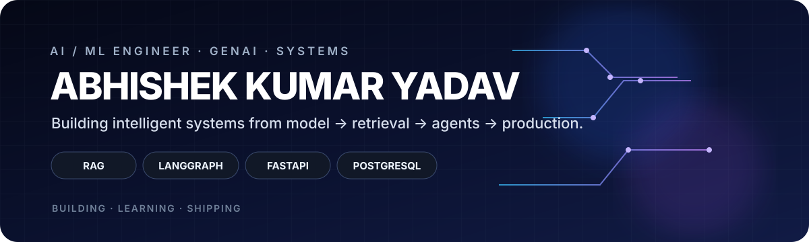
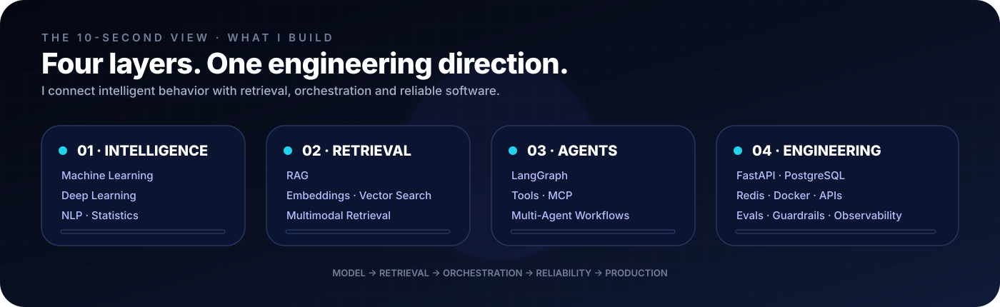
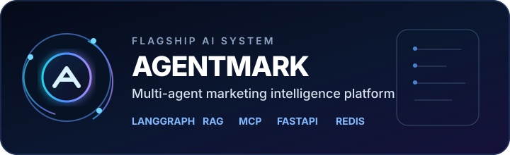
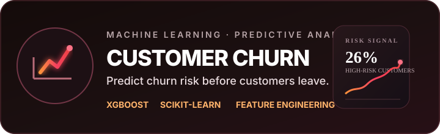
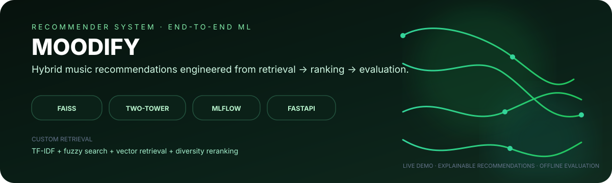
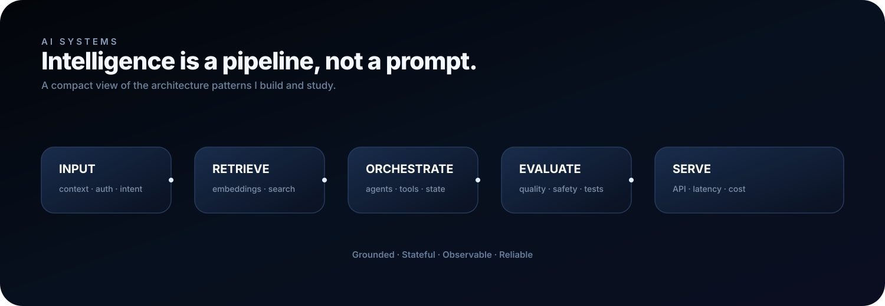
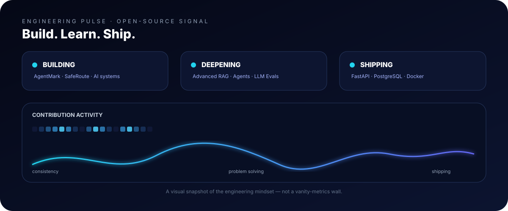

 &nbsp;&nbsp;  

# ✦ What I Build

<b>MODEL</b> → <b>RETRIEVAL</b> → <b>ORCHESTRATION</b> → <b>RELIABILITY</b> → <b>PRODUCTION</b>

---

# 🚀 Systems I've Built

**AgentMark** is a full-stack multi-agent AI platform for research, strategy, copy generation, evaluation, human approval and publishing.

`LangGraph` `LangChain` `RAG` `MCP` `FastAPI` `PostgreSQL` `Redis` `TypeScript`

**Customer Churn Prediction** is an applied ML system for identifying customers at risk of churn, with preprocessing, feature engineering, model training and evaluation surfaced through a practical application.

`Python` `Pandas` `Scikit-learn` `XGBoost` `Feature Engineering` `Model Evaluation`

**Moodify** is an end-to-end hybrid music recommendation engine built from scratch, combining FAISS retrieval, TF-IDF/fuzzy search, self-supervised embeddings and profile-aware two-tower ranking.

`FAISS` `TensorFlow` `Two-Tower` `MLflow` `Streamlit` `FastAPI`

&nbsp;

---

# 🧠 My AI Stack

  <b>GENAI</b> · `RAG` · `Embeddings` · `Vector Search` · `LangChain` · `LangGraph` · `MCP` · `Tool Calling` · `Structured Outputs` · `LLM Evals` · `Guardrails`  <b>ML</b> · `NumPy` · `Pandas` · `Scikit-learn` · `XGBoost` · `Feature Engineering` · `Model Evaluation` · `Deep Learning`  <b>ENGINEERING</b> · `FastAPI` · `Pydantic` · `SQLAlchemy` · `PostgreSQL` · `Redis` · `JWT` · `Docker` · `GitHub Actions`

---

# 🏗️ A System View

---

# 📈 Engineering Pulse

  

 &nbsp;

---

# 🧭 The AI Journey

<b>FOUNDATIONS</b> → <b>MACHINE LEARNING</b> → <b>DEEP LEARNING</b> → <b>LLMs</b> → <b>RAG</b> → <b>AGENTS</b> → <b>PRODUCTION AI</b>  `Advanced RAG` → `Hybrid Retrieval` → `Reranking` → `Multimodal RAG` `LangGraph` → `Deep Agents` → `MCP` → `Agent Evaluation` `LLM Evals` → `LLM Gateways` → `Guardrails` → `Observability`

---

# ⚡ Now

| | FOCUS | WHY |\n|:--:|:--|:--|\n| **01** | **Advanced RAG** | Retrieval quality, grounding & multimodal search |\n| **02** | **Agentic Systems** | Stateful workflows, tools, MCP & evaluation |\n| **03** | **AI Reliability** | Evals, guardrails, observability & failure modes |\n| **04** | **Engineering Depth** | FastAPI, PostgreSQL, Docker & system design |

---

# 🏆 Beyond Code

| 🎓 | 🏅 | 🚀 |\n|:--:|:--:|:--:|\n| **B.Tech CSE** Haridwar University · 2027 | **1st Place** AI Quiz · 50+ teams | **2× Team Leader** National hackathons |

---

# Build. Learn. Ship. Repeat. Building toward the point where an AI idea can become a reliable system.    

