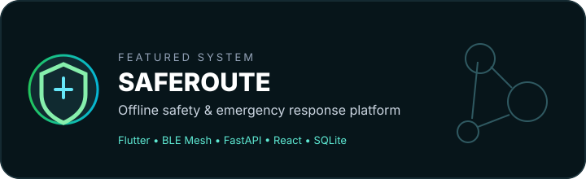
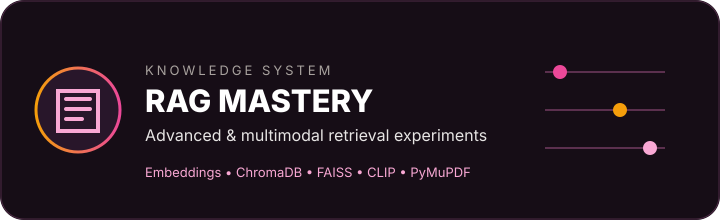

 

&nbsp;

&nbsp;

  

 

# ✦ What I Build

 

<b>MODEL</b> → <b>RETRIEVAL</b> → <b>ORCHESTRATION</b> → <b>RELIABILITY</b> → <b>PRODUCTION</b>

---

# 🚀 Systems I've Built

**AgentMark** is a full-stack multi-agent AI platform for research, strategy, copy generation, evaluation, human approval and publishing.

`LangGraph` `LangChain` `RAG` `MCP` `FastAPI` `PostgreSQL` `Redis` `TypeScript`

 

**SafeRoute** is an offline-first safety and emergency response platform combining a Flutter app, FastAPI backend and authority dashboard for constrained-connectivity environments.

`Flutter` `BLE Mesh` `FastAPI` `React` `SQLite` `JWT` `Geospatial Systems`

 

**RAG Mastery** is my practical exploration of retrieval systems, including dense retrieval, vector search and multimodal PDF retrieval over text + images.

`SentenceTransformers` `ChromaDB` `FAISS` `CLIP` `PyMuPDF` `LangChain`

---

# 🧠 My AI Stack

  

**GENAI**  `RAG` · `Embeddings` · `Vector Search` · `LangChain` · `LangGraph` · `MCP` · `Tool Calling` · `Structured Outputs` · `LLM Evals` · `Guardrails`

**ML**  `NumPy` · `Pandas` · `Scikit-learn` · `XGBoost` · `Feature Engineering` · `Model Evaluation` · `Deep Learning`

**ENGINEERING**  `FastAPI` · `Pydantic` · `SQLAlchemy` · `PostgreSQL` · `Redis` · `JWT` · `Docker` · `GitHub Actions`

---

# 🏗️ A System View

---

# 📈 Engineering Pulse

&nbsp;

---

# 🧭 The AI Journey

 
FOUNDATIONS → MACHINE LEARNING → DEEP LEARNING → LLMs → RAG → AGENTS → PRODUCTION AI

 

`Advanced RAG`  →  `Hybrid Retrieval`  →  `Reranking`  →  `Multimodal RAG`

`LangGraph`  →  `Deep Agents`  →  `MCP`  →  `Agent Evaluation`

`LLM Evals`  →  `LLM Gateways`  →  `Guardrails`  →  `Observability`

---

# ⚡ Now

| | FOCUS | WHY |
|:--:|:--|:--|
| **01** | **Advanced RAG** | Retrieval quality, grounding & multimodal search |
| **02** | **Agentic Systems** | Stateful workflows, tools, MCP & evaluation |
| **03** | **AI Reliability** | Evals, guardrails, observability & failure modes |
| **04** | **Engineering Depth** | FastAPI, PostgreSQL, Docker & system design |

<b>📚 How I learn</b>

 

I prefer understanding the mechanism behind an abstraction rather than memorising an API. The target is always the same: **observable, testable, deployable and explainable systems**.

---

# 🏆 Beyond Code

| 🎓 | 🏅 | 🚀 |
|:--:|:--:|:--:|
| **B.Tech CSE** Haridwar University · 2027 | **1st Place** AI Quiz · 50+ teams | **2× Team Leader** National hackathons |

---

# Build. Learn. Ship. Repeat.

Building toward the point where an AI idea can become a reliable system.

  

  

