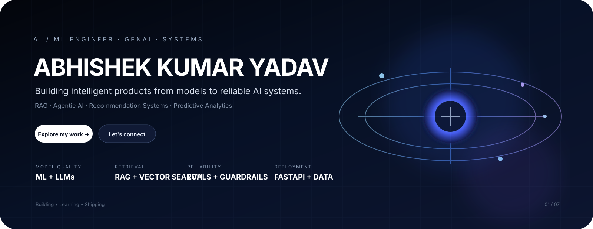

 

<a href="https://github.com/Abhishek01112002?tab=repositories"><strong>Projects</strong></a>&nbsp;&nbsp;&nbsp; <a href="https://www.linkedin.com/in/abhishek-kumar-yadav-datascience"><strong>LinkedIn</strong></a>&nbsp;&nbsp;&nbsp; <a href="mailto:ahishek0111@gmail.com"><strong>Email</strong></a>

 

## Selected work

<table width="100%">
<tr>
<td width="33%" valign="top" align="center">

  
<strong>AgentMark</strong> 
Multi-agent marketing intelligence with LangGraph, RAG, MCP and production APIs.
  
<a href="https://agentmark.ahishek0111.workers.dev/">Live</a> · <a href="https://github.com/Abhishek01112002/AgentMark">Source</a>
</td>
<td width="33%" valign="top" align="center">

  
<strong>Moodify</strong> 
Hybrid recommendation system with FAISS, embeddings and a profile-aware two-tower model.
  
<a href="https://moodify-byabhishek.streamlit.app/">Live</a> · <a href="https://github.com/Abhishek01112002/Moodify">Source</a>
</td>
<td width="33%" valign="top" align="center">

  
<strong>Customer Churn</strong> 
Production-style ML application with pipelines, evaluation, API serving and an interactive app.
  
<a href="https://customer-churn-prediction-by-abhishek.streamlit.app/">Live</a> · <a href="https://github.com/Abhishek01112002/customer-churn-prediction">Source</a>
</td>
</tr>
</table>

 

 

<strong>Core stack</strong>

  

Python&nbsp;&nbsp; · &nbsp;&nbsp;PyTorch&nbsp;&nbsp; · &nbsp;&nbsp;FastAPI&nbsp;&nbsp; · &nbsp;&nbsp;PostgreSQL&nbsp;&nbsp; · &nbsp;&nbsp;Redis&nbsp;&nbsp; · &nbsp;&nbsp;Docker

 

RAG&nbsp;&nbsp; · &nbsp;&nbsp;LangChain&nbsp;&nbsp; · &nbsp;&nbsp;LangGraph&nbsp;&nbsp; · &nbsp;&nbsp;MCP&nbsp;&nbsp; · &nbsp;&nbsp;LLM Evals&nbsp;&nbsp; · &nbsp;&nbsp;Guardrails

  

 

  

ML foundations → LLMs → RAG → Agents → Evals → Production AI

  

<strong>Build. Measure. Improve.</strong>

 

Open to AI/ML engineering opportunities and ambitious systems work.

