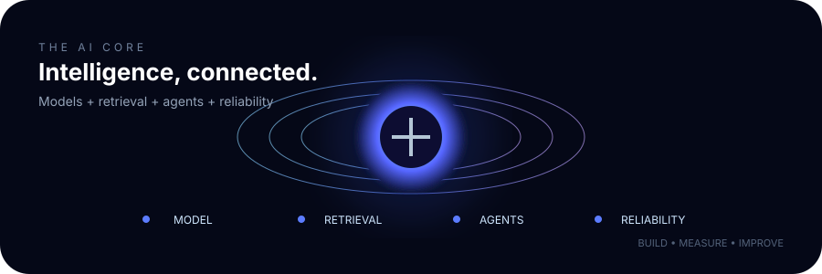

  

<a href="https://github.com/Abhishek01112002?tab=repositories">Projects</a> · <a href="https://www.linkedin.com/in/abhishek-kumar-yadav-datascience">LinkedIn</a> · <a href="mailto:ahishek0111@gmail.com">Email</a>

## What I build

I build AI products across four layers: **machine learning, retrieval, agentic orchestration, and production engineering**.

---

## Selected work

### AgentMark

Multi-agent marketing intelligence platform built around LangGraph, RAG, MCP, FastAPI, PostgreSQL and Redis.

**[Live demo](https://agentmark.ahishek0111.workers.dev/) · [Source](https://github.com/Abhishek01112002/AgentMark)**

### Moodify

Hybrid music recommendation engine combining FAISS retrieval, fuzzy search, self-supervised embeddings and a profile-aware two-tower model.

**[Live demo](https://moodify-byabhishek.streamlit.app/) · [Source](https://github.com/Abhishek01112002/Moodify)**

### Customer Churn Prediction

End-to-end ML application for churn risk prediction with preprocessing, feature engineering, model evaluation and an interactive dashboard.

**[Live demo](https://customer-churn-prediction-by-abhishek.streamlit.app/) · [Source](https://github.com/Abhishek01112002/customer-churn-prediction)**

---

## Technology

  

**Generative AI** · RAG · Embeddings · Vector Search · LangChain · LangGraph · MCP · Tool Calling · LLM Evals · Guardrails

**Machine Learning** · NumPy · Pandas · Scikit-learn · XGBoost · Deep Learning · Recommendation Systems

**Engineering** · FastAPI · Pydantic · SQLAlchemy · PostgreSQL · Redis · Docker · GitHub Actions

---

## System architecture

Designed around the idea that a useful AI system needs more than an LLM call: it needs retrieval, state, tools, evaluation, safety and observability.

---

## Engineering signal

  

---

## Current direction

**ML foundations** → **LLMs** → **RAG** → **Agents** → **Evals & Guardrails** → **Production AI**

I am currently going deeper into advanced RAG, LangGraph, Deep Agents, MCP, LLM evaluation, LLM gateways, guardrails and production AI architecture.

---

### Build. Measure. Improve.

Open to AI/ML engineering opportunities, challenging systems work and meaningful collaborations.

**[LinkedIn](https://www.linkedin.com/in/abhishek-kumar-yadav-datascience) · [GitHub](https://github.com/Abhishek01112002) · [Email](mailto:ahishek0111@gmail.com)**

